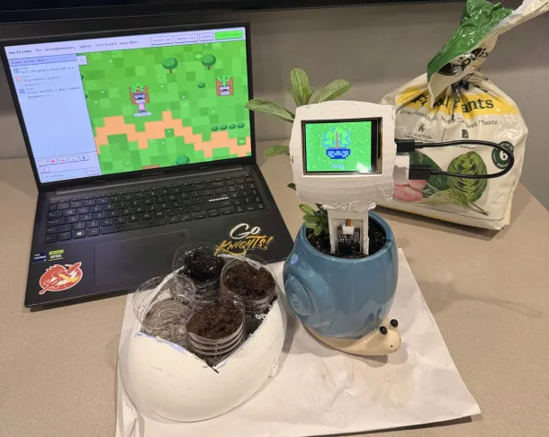

# greghouse 🌱

> come grow something.

BloomKnights 2026, A 12-hour hackathon | Built by [Sebastian](https://www.linkedin.com/in/sebastian-noel-ucf/), [Alejandro](https://www.linkedin.com/in/alejaimes/), [Stevin](https://www.linkedin.com/in/georgestevin/), [Otavio](https://www.linkedin.com/in/otavioborrelly/)



A **multiplayer virtual-garden** web where where the owner grows **pixel-art plants with
moods, chats and recorded voices**. Vistors are able to walk around the garden over a
**shared experience**. The owner is able to create virtual plants as well as being able
to connect their own living plant into the virtual garden through a novel device.
The device consists of a **ESP32 and a probing moisture sensor** that detects the soil
moisture percentage, all enclosed in a **3D printed structure**. The moisture percentage
affects the plant's mood and other players are able to alarm the owner if the moisture
is low. 


## Running it

```bash
npm install && (cd client && npm install)   # once

npm run server      # Node server → http://localhost:3000
npm run dev         # Vite dev on :5173 (proxies /api, /ws, /telemetry → :3000)

npm run build       # production: client/dist, served by the Node server
npm run tunnel      # expose :3000 publicly via cloudflared (share links + CYD)
```

## Public hosting

This app is hosted with a long-running local 
Node process that serves the app, API, WebSocket, and garden
database, while Cloudflare Tunnel exposes port 3000 publicly.

```bash
npm run build
npm run server
npm run tunnel
```

Use the `https://...trycloudflare.com` address printed by `npm run tunnel`.
Quick-tunnel addresses change whenever `cloudflared` restarts, so verify the
active address before sharing it. Do not deploy this app to Render or a
serverless host; its WebSockets, local JSON database, and ffmpeg process need
the long-running Node server.

- Copy `.env.example` to `.env` for server config (`PORT`, `GOOGLE_CLIENT_ID`,
  `TELEMETRY_UPSTREAM`) — `npm run server` loads it automatically. `.env` is
  gitignored.
- `PORT` overrides 3000. `GOOGLE_CLIENT_ID` enables Google sign-in and
  disables dev login. Delete `server/data.json` to reset gardens.
- `ffmpeg` must be on PATH (voice transcoding for the CYD).
- ⚠ **Restart the server after editing `server/index.js`** — a stale process
  404s new endpoints silently.
- `?debug=1` (or double-click the title as owner) opens the debug panel.


## The hardware module (CYD)

ESP32-2432S028: ST7789 2.8" TFT, XPT2046 resistive touch, CH340 serial. Capacitive soil probe on **GPIO35 only**
(ADC1 — ADC2 is garbage while WiFi is up): AOUT→P3 "IO35", VCC→CN1 3V3,
GND→CN1 GND. Speaker on SPEAK's tiny inner pins (GPIO26 DAC) will then get to the cloud.

## Soil telemetry — sent through AWS cloud

The cloud will receive the JSON readings from the ESP32 which is necessary for the soil
moisture to be detected, which will then be pushed to AWS/Lambda using DynamoDB, as well as creating from there the timestamp
and the plantID necessary. 

## Web App

Connected the readings from the database in order to show the moisture levels in real time in the web and making
different personality types for each plant, gamifying the experience of watering plants by having fun interactions with an
automated randomized chats in the side and having sound effects be played by proximity alongside a pixel-art styled vibe.

